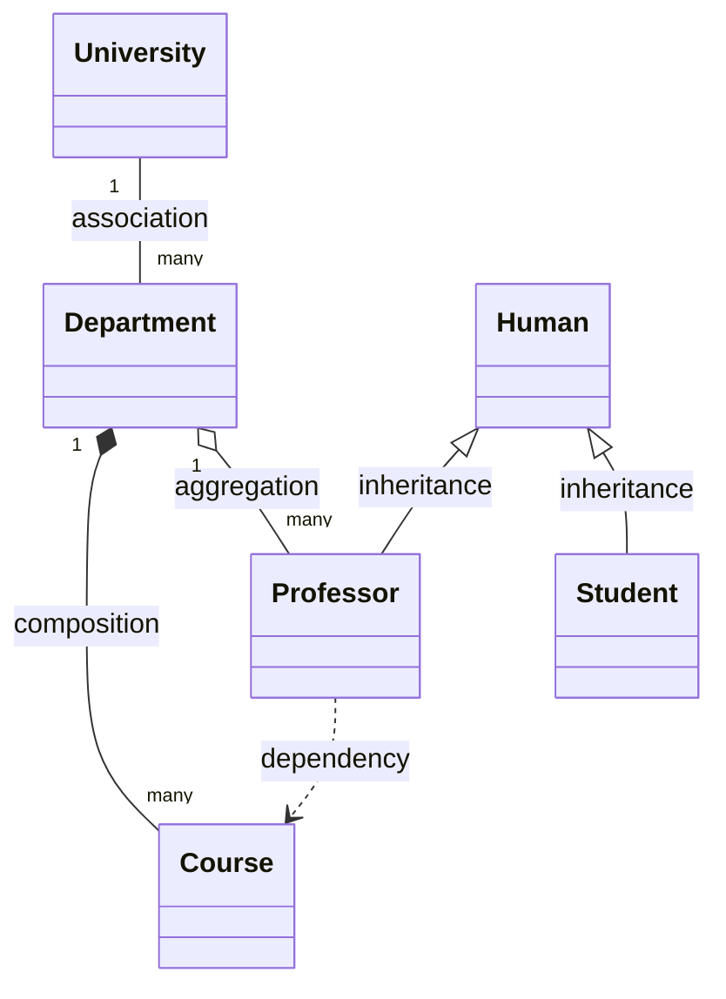

# Relation types
## Association

```c++
#include<vector>
#include<string>

class Departament;
class Univercity{
    private:
        std::string name;
        std::vector<Departament*> departaments;
    public:
        Univercity(std::string name);
    }

    class Departament{
        private:
            std::string name;
        public:
            Departament(std::string name);
    }
```
## Aggregation
```c++
class Professor;
class Departament{
    private:
        std::string name;
        std::vector<Professor*> professors;
    public:
        Departament(std::string name);
        void addProfessor(Professor* professor);
}

    class Professor{
        private:
            std::string name;
        public:
            Professor(std::string name);
    }
```
## Composition
```c++
    class Course;
    class Departament{
        private:
            std::string name;
            std::vecotr<Course*> courses;
        public:
            Departament(std::string name);
            void addCourse(Course* course);
            ~Departament()
            {
                for(auto course : courses)
                {
                    delete course:
                }
            }
    }
    class Course{
        private:
            std::string name;
        public:
            Course(std::string name);
    }
```
## Inheritance
```c++
class Human{
    public:
        std::string name;
        int age;
}
class Student : public Human{
    int course;
}

class Professor : public Human{
    std::vector<Course*> courses;
}
```
## Dependency
```c++
class Course;
class Professor{
    private:
        std::string name;
    public:
        Professor(std::string name);
        void teachCourse(Course* course);

}

class Course{
    private:
        std::string name;
    public:
        Course(std::string name);
}
```

